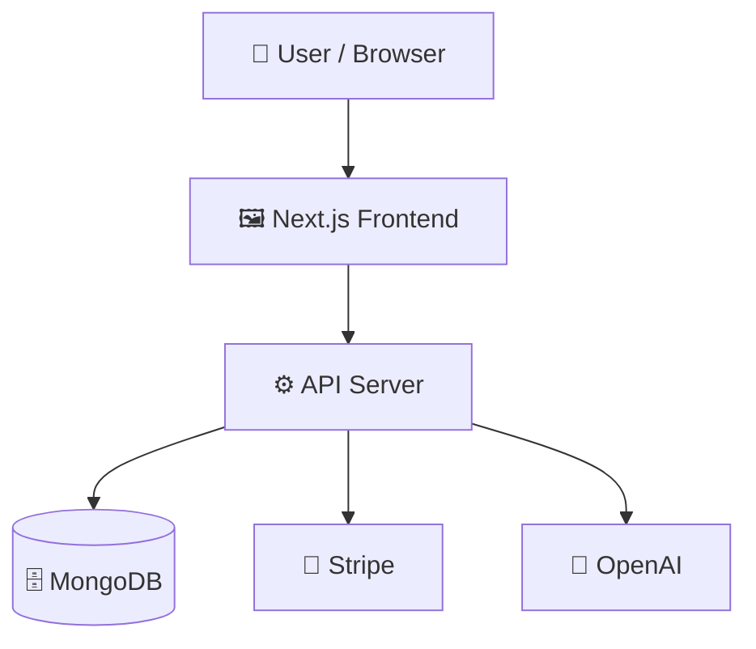

# vision

> Full-stack Next.js web application integrated with AI, Stripe payments, and Clerk authentication.

[](https://vision-steel-pi.vercel.app/)
   
   

## 📑 Table of Contents

- [Description](#description)
- [Key Features](#key-features)
- [Use Cases](#use-cases)
- [Tech Stack](#tech-stack)
- [Architecture](#architecture)
- [Quick Start](#quick-start)
- [Key Dependencies](#key-dependencies)
- [Available Scripts](#available-scripts)
- [API Endpoints](#api-endpoints)
- [Project Structure](#project-structure)
- [Development Setup](#development-setup)
- [Contributors](#contributors)
- [Contributing](#contributing)

## 📝 Description

Vision is a full-stack web application built on Next.js, TypeScript, and Tailwind CSS. It combines modern client and server technologies to deliver AI-driven features alongside user management and subscription capabilities.\n\nThe application architecture leverages Hono for API endpoint routing, Mongoose for MongoDB database interactions, and OpenAI APIs for backend intelligence. User authentication and UI components are powered by Clerk, while client-side state and data validation are handled using TanStack Query, React Hook Form, and Zod.\n\nDesigned for modern web development, Vision provides a cohesive starting point for building scalable web applications that require AI tools, user sessions, and payment processing out of the box.

## ✨ Key Features

- **🔐 Clerk User Authentication** — User authentication and session management powered by Clerk integration.
- **🤖 OpenAI Backend Capabilities** — AI processing and features powered by the OpenAI API integration.
- **💳 Stripe Billing and Payments** — Subscription management and payment processing powered by Stripe.
- **⚡ Hono API Endpoint Routes** — Fast and lightweight API route handling using the Hono framework.
- **🗄️ MongoDB and Mongoose Persistence** — Data persistence and object modeling managed through Mongoose and MongoDB.
- **📋 Type-Safe Form Validation** — Robust form handling and schema validation using React Hook Form and Zod.
- **🔄 TanStack Query Data Fetching** — Client-side asynchronous data fetching and caching with TanStack Query.

## 🎯 Use Cases

- Building a web application requiring AI workflows, user accounts, and billing.
- Developing a Next.js full-stack app backed by Hono routes and MongoDB.
- Deploying a SaaS platform with integrated Stripe payments and Clerk authentication.

## 🛠️ Tech Stack

   

**Notable libraries:** Clerk, Hono, Mongoose, OpenAI, React Hook Form, Stripe, TanStack Query, Zod

## 🏗️ Architecture

A high-level view of how the main pieces fit together:



## ⚡ Quick Start

```bash

# 1. Clone the repository
git clone https://github.com/ni3420/vision.git

# 2. Install dependencies
npm install

# 3. Start the dev server
npm run dev
```

## 📦 Key Dependencies

```
@base-ui/react: ^1.6.0
@clerk/express: ^2.1.43
@clerk/hono: ^0.1.53
@clerk/nextjs: ^7.5.20
@clerk/ui: ^1.25.5
@google/genai: ^2.12.0
@hono/clerk-auth: ^3.1.1
@hono/zod-validator: ^0.9.0
@hookform/resolvers: ^5.4.0
@musicapi/sdk: ^0.1.0
@tanstack/react-query: ^5.101.2
axios: ^1.18.1
class-variance-authority: ^0.7.1
clsx: ^2.1.1
cmdk: ^1.1.1
```

## 🚀 Available Scripts

- **dev** — `npm run dev`
- **build** — `npm run build`
- **start** — `npm run start`
- **lint** — `npm run lint`

## 🌐 API Endpoints

Detected endpoints (best-effort scan):

```
/api/[[...route]]
```

## 📁 Project Structure

```
.
├── AGENTS.md
├── CLAUDE.md
├── bun.lock
├── components.json
├── eslint.config.mjs
├── next.config.ts
├── package.json
├── postcss.config.mjs
├── public
│   ├── file.svg
│   ├── globe.svg
│   ├── next.svg
│   ├── vercel.svg
│   └── window.svg
├── src
│   ├── app
│   │   ├── (dashboard)
│   │   │   ├── conversation
│   │   │   │   └── page.tsx
│   │   │   ├── image-generator
│   │   │   │   └── page.tsx
│   │   │   ├── layout.tsx
│   │   │   ├── music-generator
│   │   │   │   └── page.tsx
│   │   │   ├── page.tsx
│   │   │   └── video-generator
│   │   │       └── page.tsx
│   │   ├── api
│   │   │   └── [[...route]]
│   │   │       └── route.ts
│   │   ├── auth
│   │   │   ├── sign-in
│   │   │   │   └── [[...sign-in]]
│   │   │   │       └── ...
│   │   │   └── sign-up
│   │   │       └── [[...sign-up]]
│   │   │           └── ...
│   │   ├── favicon.ico
│   │   ├── globals.css
│   │   ├── layout.tsx
│   │   └── not-found.tsx
│   ├── components
│   │   ├── Input.tsx
│   │   ├── loading-spinner.tsx
│   │   ├── plan.tsx
│   │   ├── skeleton.tsx
│   │   └── ui
│   │       ├── button.tsx
│   │       ├── command.tsx
│   │       ├── dialog.tsx
│   │       ├── input-group.tsx
│   │       ├── input.tsx
│   │       ├── select.tsx
│   │       ├── sheet.tsx
│   │       └── textarea.tsx
│   ├── db
│   │   └── db.ts
│   ├── features
│   │   ├── Subscription
│   │   │   ├── api
│   │   │   │   └── use-create-subscription.ts
│   │   │   ├── components
│   │   │   │   ├── upgarde-model.tsx
│   │   │   │   └── upgrade-banner.tsx
│   │   │   └── server
│   │   │       └── route.ts
│   │   ├── auth
│   │   │   ├── api
│   │   │   │   ├── use-current-user.ts
│   │   │   │   └── use-login.ts
│   │   │   ├── schema.ts
│   │   │   └── server
│   │   │       └── route.ts
│   │   ├── conversation
│   │   │   ├── api
│   │   │   │   ├── use-create-conversation.ts
│   │   │   │   ├── use-delete-conversation.ts
│   │   │   │   ├── use-get-all-conversation.ts
│   │   │   │   ├── use-get-conversation.ts
│   │   │   │   └── use-post-message.ts
│   │   │   ├── components
│   │   │   │   ├── conversation-history.tsx
│   │   │   │   ├── create-conversation.tsx
│   │   │   │   └── show-conversation.tsx
│   │   │   ├── schema.ts
│   │   │   └── server
│   │   │       └── route.ts
│   │   ├── dashboard
│   │   │   └── components
│   │   │       ├── Success.tsx
│   │   │       ├── dashboard-page.tsx
│   │   │       ├── mobile-sidebar.tsx
│   │   │       ├── navbar.tsx
│   │   │       └── sidebar.tsx
│   │   ├── image
│   │   │   ├── api
│   │   │   │   ├── use-create-image.ts
│   │   │   │   └── use-image-history.ts
│   │   │   ├── components
│   │   │   │   ├── create-image-form.tsx
│   │   │   │   ├── image-history.tsx
│   │   │   │   └── images-view.tsx
│   │   │   ├── schema.ts
│   │   │   └── server
│   │   │       └── route.ts
│   │   └── music
│   │       ├── api
│   │       │   ├── use-get-music-history.ts
│   │       │   └── use-music-genrate.ts
│   │       ├── components
│   │       │   ├── create-music.tsx
│   │       │   └── music-history.tsx
│   │       ├── schema.ts
│   │       └── server
│   │           └── route.ts
│   ├── gemini
│   │   ├── conversation-ai.ts
│   │   └── gemini.ts
│   ├── lib
│   │   ├── client.ts
│   │   ├── stripe.ts
│   │   └── utils.ts
│   ├── middleware
│   │   └── freeUsesLimit-middleware.ts
│   ├── models
│   │   ├── conversation.models.ts
│   │   ├── image.models.ts
│   │   ├── music.models.ts
│   │   └── user.models.ts
│   ├── providers
│   │   └── providers.tsx
│   └── proxy.ts
└── tsconfig.json
```

## 🛠️ Development Setup

### Node.js / JavaScript
1. Install Node.js (v18+ recommended)
2. Install dependencies: `npm install` (or `yarn` / `pnpm install` / `bun install`)
3. Start the dev server: see the **Quick Start** above

## 👥 Contributors

Thanks to everyone who has contributed to this project:

<p align="left">
<a href="https://github.com/ni3420" title="ni3420"></a>
</p>

[See the full list of contributors →](https://github.com/ni3420/vision/graphs/contributors)

## 👥 Contributing

Contributions are welcome! Here's the standard flow:

1. **Fork** the repository
2. **Clone** your fork: `git clone https://github.com/ni3420/vision.git`
3. **Branch**: `git checkout -b feature/your-feature`
4. **Commit**: `git commit -m 'feat: add some feature'`
5. **Push**: `git push origin feature/your-feature`
6. **Open** a pull request


</div>
